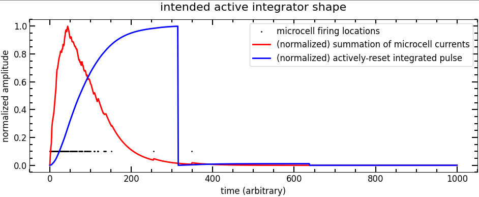

# Active integration shaper

## Motivation

The Bridgeport SiPM-3000 has a 40 MSPS ADC which is fine for scintillators like sodium or cesium iodide.
Issues arise when using fast scintillators like LYSO or CeBr3 because the pulses are so fast
    (~50-100ns rise time and decay constant).

Traditional pulse shaping (e.g. the Cremat [CR-200-X](https://www.cremat.com/home/cr-200-x-shaper-modules/) modules)
    assume that the preamplified pulse is the integral of the detector output current.
They perform a CR differentiation followed by two RC active integrators.
However,
    integrating preamplifiers are not the best to use with SiPMs
    --especially those with large area--
    because the SiPM capacitance combined with the feedback integration capacitor
    vastly lowers the system bandwidth and makes things slow.
Again,
    this may be fine for scintillators like CsI or NaI,
    but to maintain fast pulses (~100ns) we need to do something else.

The Bridgeport 3000 integrates pulses in software but doesn't do very well
    with fast pulses.
So,
    the goal of this circuit is to integrate the pulses in analog land to give the 40MSPS ADC enough time to sample it.

We still want to maintain a "fast" system, though,
    so the circuit features an active reset which will drain the integration
    capacitor after a fixed time (say, 4x the SiPM pulse time constant.)

## Principle of operation
The operating principle is simple and consists of three main components:
- An inverting integrator--we use the inverting configuration instead of noninverting so we don't need to match R/C pairs.
- An op amp inverter to make the 'integration' pulse the same as the input polarity. The Bridgeport board expects a negative-polarity preamplified pulse.
- A reset circuit based on a one-shot "monostable oscillator." We're stealing this design from the peak-hold circuit.

## Overview of how it should work
We can simulate this integration filter in software. An example is shown in the following figure produced by `simulate_integrator.ipynb`.

